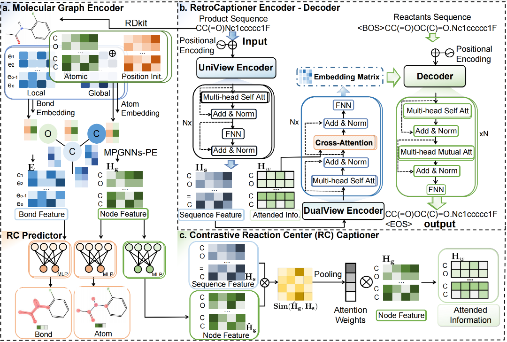

# RetroCaptioner

## Title
RetroCaptioner: Beyond Attention in End-to-end Retrosynthesis Transformer via Dynamically Integrated Learnable Graph Representation
## Abstract
Retrosynthesis is crucial in drug discovery, identifying available precursor molecules for novel drugs. With the growing advancement and practicality of language models, Transformer-based models are increasingly used to automate this process. However, most of the existing methods lack an efficient way to capture the reaction transformation information and are limited in the applicability of their predictions. 

In this work, we present RetroCaptioner, a novel end-to-end framework for one-step retrosynthesis that combines the power of a graph encoder, which integrates learnable structural information, with the capability to sequentially translate drugs, thereby efficiently capturing chemically plausible information. Specifically, the proposed Contrastive Reaction-Center Captioner module dynamically captions the reactive center. This strategy guides attention model training through contrastive learning surpassing traditional attention, and combines the two-stage processes of graph neural network-based methods into one-step learning, producing more practical and accurate predictions. Evaluating our model on the benchmark dataset USPTO-50k, we achieved SOTA performance among all Transformer-based retrosynthesis models with a promising 65.4% top-1 and 91.1% top-10 accuracy. The superior 99.4% top-1 SMILES validity result highlights the effectiveness in capturing chemically plausible information. In the application of drug synthesis route planning, RetroCaptioner identifies shortened and optimal pathways that accurately correspond to established reactions, offering valuable insights for reliable and high-quality organic synthesis in drug discovery.

##Setup
RetroCaptioner requires anaconda with Python 3.7 or later, cudatoolkit=10.2.

Sugguest to install RetroCaptioner in a virtual environment to prevent conflicting dependencies.
、、、
conda create -n RetroCaptioner python==3.7
conda activate RetroCaptioner
conda install --yes --file requirements.txt
、、、

## Train the model and perform the retrosynthesis step
To train the model, please run the train.py file. After the training is completed, you can run the translate.py for one-step retrosynthesis prediction
